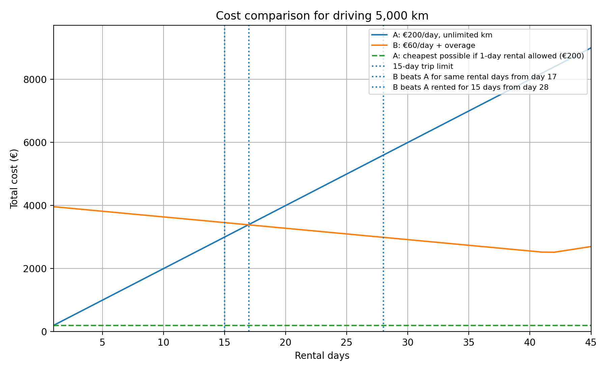

Slogan: No AI. Just AI highligths afterwards. Like: fill 4."AI says" most meaningfull and thesis way: ...

AI decomposition: `homework/math/decomposition.md`

## Q:
You need to drive from point A to point B with a total of 5,000 km in 15 days (you are unable to change cars during rental).
2 car rental conditions:
- A.  200€ / day, and no limits on kilometers;
- B.  60€ / day, but has limited mileage 120 km per day. The next kilometers will cost 0.80€/km.

Q: What is the cheapest way to do this?

## A:
### 1) Missing preliminary information:
- car maximum speed
- can we go faster than 15 days in total?

### 2) Assumptions: 
Let us assume greedy model, we drive on maximum speed like Vmax = [110km / h] but we need to cover
5000km / (15 * 24h) = 13.(8) AVG speed per day. So Vavg = Tmin_rate * Vmax.
Tmin_h = Tmin_rate * 24 ~= 3h. So, its lower bound of minimal hours we have to spend on driving if car max allowed speed is 110km / h. 
So just to validate the assumptions and operate with mileage/per day.
We will compare total_cost_max in order to find cheapest way.
We will use linear distribution model of way coverage per day. Same pattern across the journey. 
So in B model we will drive 5000 / 15 = 333.(3) km / day.

In most common case we might solve optimization task with Lagrange limitations and provide with symbolic / computational solution. 
Let us passthrough this idea to GPT-5.5 PRO extnded:

### 3) Calculations:
- A. condition total_cost_max : 200€ * 15 = **3000€**
- B. condition total_cost_max: 15 * (60€ + (333.(3) - 120) * 0.80€) = **3456 €** (might be some roundind issue, but it does not matter)
- C. Let's find out real optimal strategy w/o using our brain, just intuition + AI.

So, A is cheaper when given assumptions are met. But is not the answer.

### 4) 

```AI says:
The cheapest option is **A: 200€/day with unlimited kilometers**.

The key correction is that option B’s base cost is **60€ per day**, not **60€ per 120 km block**.

For 15 days:

- Option A:  
  200€ × 15 = **3,000€**

- Option B:  
  Included mileage = 120 km/day × 15 days = **1,800 km**  
  Extra mileage = 5,000 − 1,800 = **3,200 km**  
  Extra cost = 3,200 × 0.80€ = **2,560€**  
  Total cost = 60€ × 15 + 2,560€ = 900€ + 2,560€ = **3,460€**

Therefore, option **A is cheaper by 460€**.

Speed assumptions are not needed for the price comparison unless the number of rental days can change. Under the stated condition of 5,000 km in 15 days, the cost depends only on the rental duration and total kilometers.
```

No. I know, I don't believe. Next iteration:

```
...blah-blah...

Final result:

- **A for 15 days:** 3,000€
- **B for 15 days:** 3,460€
- **B for 42 days:** 2,520€
```
my bad, messy context. Next:

```aiignore
- **A for 1 day:** 200€
- **B for 15 days:** 3,460€
- **A for 15 days:** 3,000€
```

I could proof it symbolic way, but it does not matter. We just see it:


### A is cheaper with simple naive assumptions. If the trip may be completed in **less than 15 days** and there are **no speed limits**, then the cheapest strategy is A.
Full local minimum would be at A (in worst case):
- **A for 1 day:** 200€
- **B for 15 days:** 3,460€
- **A for 15 days:** 3,000€ - that's it
